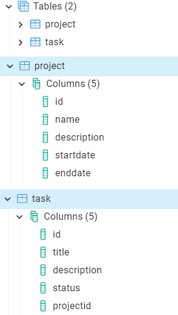

<h1>Practical Work #1  
Application with common JavaEE architecture</h1>

This work was performed by students of group 6133-010402D 
Ryskova Darya and Vechkanova Polina.

<h2>General task</h2>
You are to develop an application using common JavaEE architecture and technologies. It should have three layers (data, logic, view) and provide means to work with a database.
It is strongly recommended to use version control and source code management system (like GitHub).
It is strongly recommended to use Maven to manage your project.
You can choose any IDE, but IntelliJ IDEA is recommended.
You may not use IDE to deploy your project to an application server. All deployment should be made using administrative console.

<h2>Task 1</h2>

- Download GlassFish application server. Install it by unpacking the archive. 
Start the application server.

- Open an administrative console and go through its controls.

<h2>Task 2</h2>

- If you have no DBMS installed, please install one. 
You can choose any SQL DBMS you like, but PostgreSQL and MySQL are preferred.

The PostgreSQL database was selected for use.

<h2>Task 3</h2>

- Choose any subject area and make a model with at least two entities with a few properties. 

The subject area "Project Management" was selected. There are two entities in this area: a Project and a Task. Each project can contain
multiple tasks.

- Create a script to make a database for your model.

[ProjectManagement.db](src/ProjectManagement.db)

<h2>Task 4</h2>

- Develop data layer as Java Beans for the model and make them prepared for use with Entity Persistence.

1. Project: [ProjectRepository](src/main/java/com/example/lab1/repositories/ProjectRepository.java) and [ProjectEntity](src/main/java/com/example/lab1/models/ProjectEntity.java)

2. Task: [TaskRepository](src/main/java/com/example/lab1/repositories/TaskRepository.java) and [TaskEntity](src/main/java/com/example/lab1/models/TaskEntity.java)

<h2>Task 5</h2>

- Implement business layer for accessing data using session beans.

1. Project: [ProjectService](src/main/java/com/example/lab1/services/ProjectService.java)

2. Task: [TaskService](src/main/java/com/example/lab1/services/TaskService.java)

<h2>Task 6</h2>

- Implement view layer using any technology of your choice, which is applicable here.

[index.jsp](src/main/webapp/index.jsp)

<h2>Task 7</h2>

- Make everything work together…

