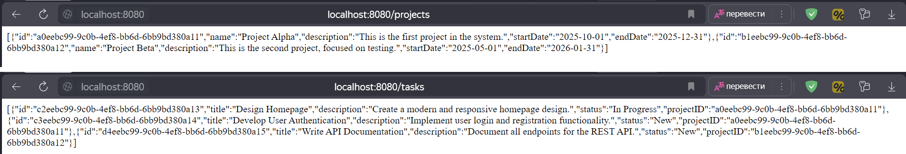
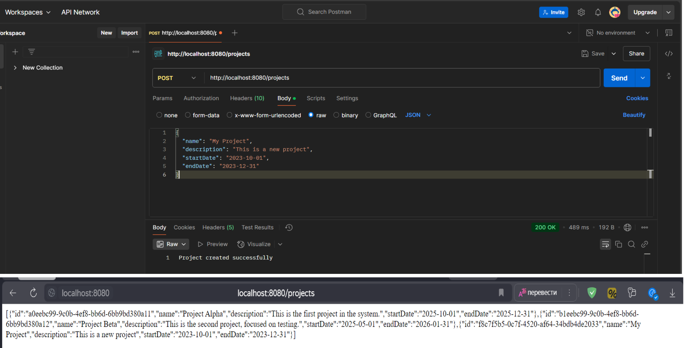
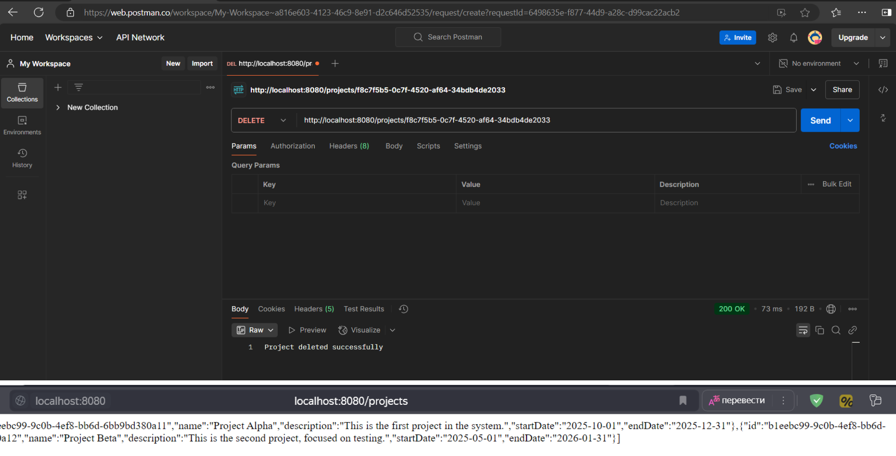

<h1>Practical Work #2  
Application using Spring Framework</h1>

This work was performed by students of group 6133-010402D 
Ryskova Darya and Vechkanova Polina.

<h2>General task</h2>
You are to develop an application using common Spring architecture and technologies. It should have three layers (data, logic, view) and provide means to work with a database.
It is strongly recommended to use version control and source code management system (like GitHub).
It is strongly recommended to use Maven to manage your project.
You can choose any IDE, but IntelliJ IDEA is recommended.

<h2>Task 1</h2>

- Choose any subject area and make a model with at least two entities with a few properties.
Create a script to make a database for your model. Yes, you can use the same models and scripts you used before.

[README.md for lab1](../lab1/README.md)

<h2>Task 2</h2>

- Develop data layer as Java Beans for the model and make them prepared for use with Hibernate.
Create additional Hibernate classes and configuration files, as required.

1. Project: [ProjectEntity](src/main/java/com/example/lab2/models/ProjectEntity.java)

2. Task: [TaskEntity](src/main/java/com/example/lab2/models/TaskEntity.java)

<h2>Task 3</h2>

- Implement business layer using Spring beans.

1. Project: [ProjectService](src/main/java/com/example/lab2/services/ProjectService.java)

2. Task: [TaskService](src/main/java/com/example/lab2/services/TaskService.java)

<h2>Task 4</h2>

- Implement view layer using Spring MVC.

1. Project: [ProjectController](src/main/java/com/example/lab2/controllers/ProjectController.java)

2. Task: [TaskController](src/main/java/com/example/lab2/controllers/TaskController.java)

<h2>Task 5</h2>

- Make everything work together…

