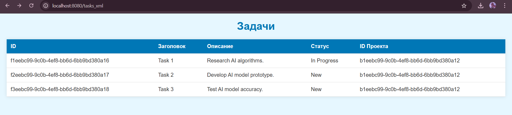
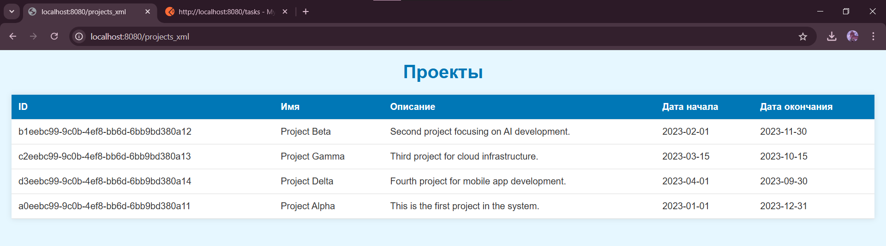
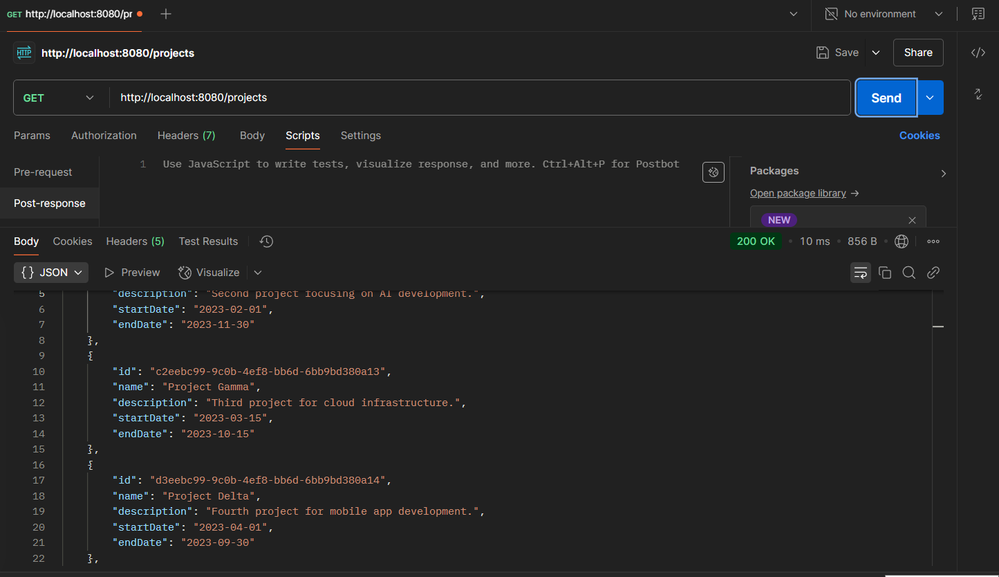
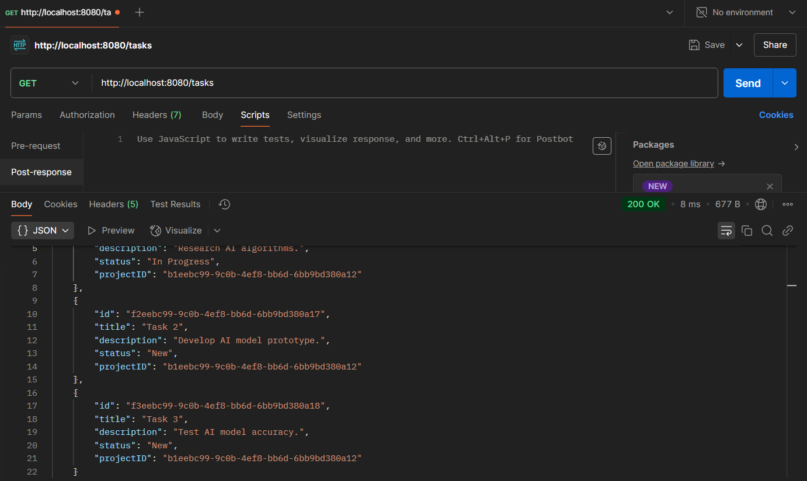

<h1>Practical Work #3  
RESTful web-service
</h1>

This work was performed by students of group 6133-010402D 
Ryskova Darya and Vechkanova Polina.

<h2>General task</h2>
You are to develop an application with REST web-service interface. Application should provide access to data within a database.
It is strongly recommended to use version control and source code management system (like GitHub).
It is strongly recommended to use Maven to manage your project.
You can choose any IDE, but IntelliJ IDEA is recommended.

<h2>Task 1</h2>

- Compare JAX-RS and SpringREST. Choose one of them for your application. Give some arguments for your choice.

Spring REST was chosen because it seamlessly integrates with the Spring ecosystem, reduces boilerplate code, and provides powerful tools for developing RESTful services within the existing Spring-based application.

<h2>Task 2</h2>

- Choose one of your previous applications for further development.
Develop a REST API for accessing your data.
1. The application from Lab 2 was selected.
2. [Controllers](src/main/java/com/example/lab3/controllers)

<h2>Task 3</h2>

- Implement the API.
  It should allow usage of both XML and JSON.

1. XML: [WebController](src/main/java/com/example/lab3/controllers/WebController.java)
2. JSON Project: [ProjectController](src/main/java/com/example/lab3/controllers/ProjectController.java)
3. JSON Task: [TaskController](src/main/java/com/example/lab3/controllers/TaskController.java)

<h2>Task 4</h2>

- Develop an XSL transformation for your XML objects to make a browser able to show them as HTML pages (including object data and navigation to other entities and their lists).

[ObjectToDomTransformer](src/main/java/com/example/lab3/utils/ObjectToDomTransformer.java)

<h2>Task 5</h2>

- Add the XSLT to all XML responses.

1. Project: [projects](src/main/resources/xmls/projects.xslt)
2. Task: [tasks](src/main/resources/xmls/tasks.xslt)
<h2>Task 6</h2>

- Make everything work together…

